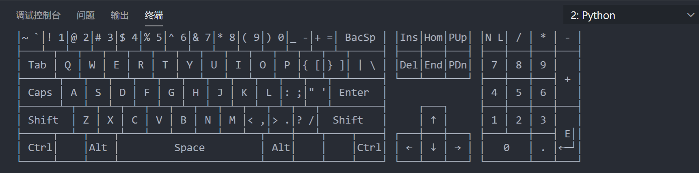

# VScode的学习和应用
## Python
Python的文件后缀名是.py
```py
print("hello world!")
```
## markdown
markdown是当前流行的一种用来写文档的语言
可以快捷生成漂亮的排版和格式
'#'代表的是一级标题
'##'代表的是二级标题

## mysql
## 流程图
## 图片
粘贴的快捷键是
ctr + alt + v
就可以把复制的图片直接粘贴过来
设置图片保存的位置，如图

